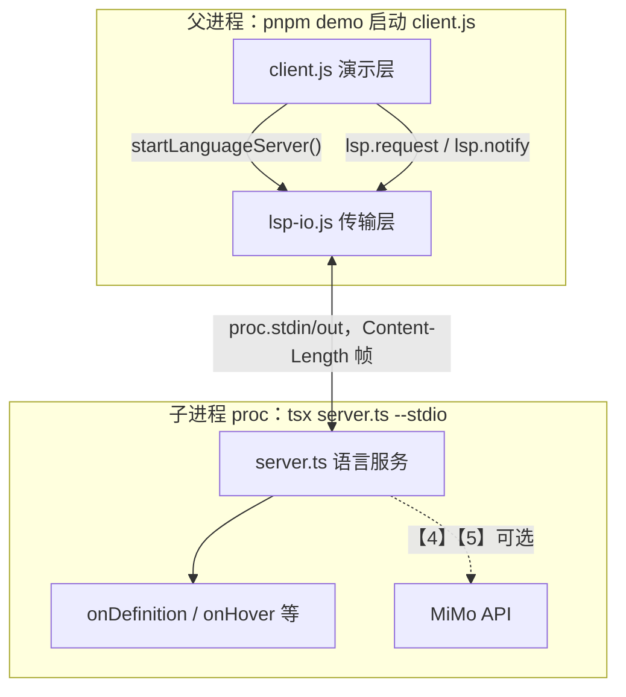
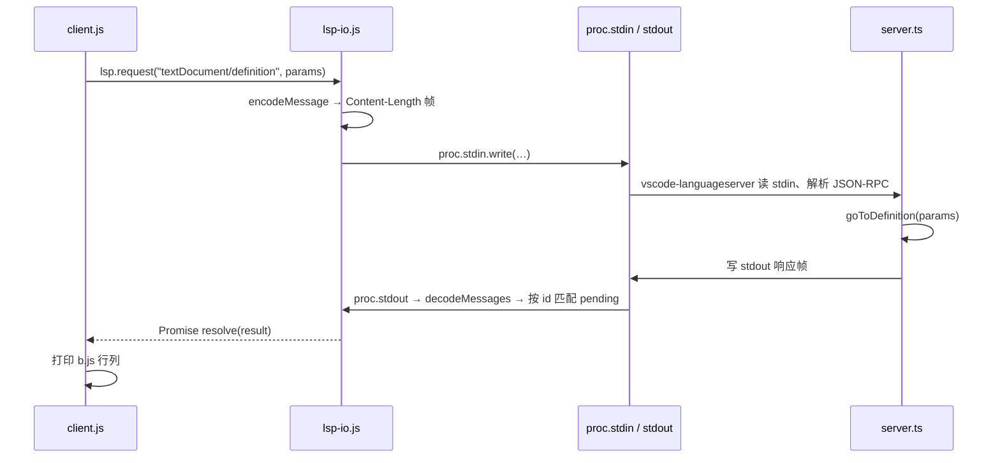
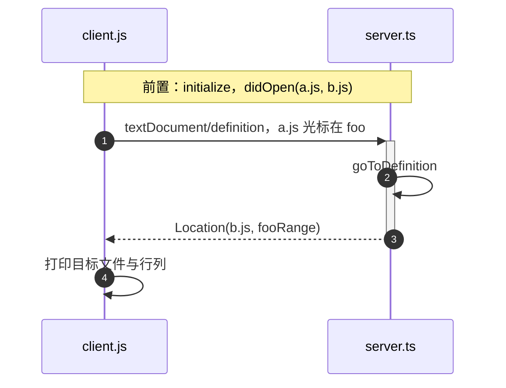
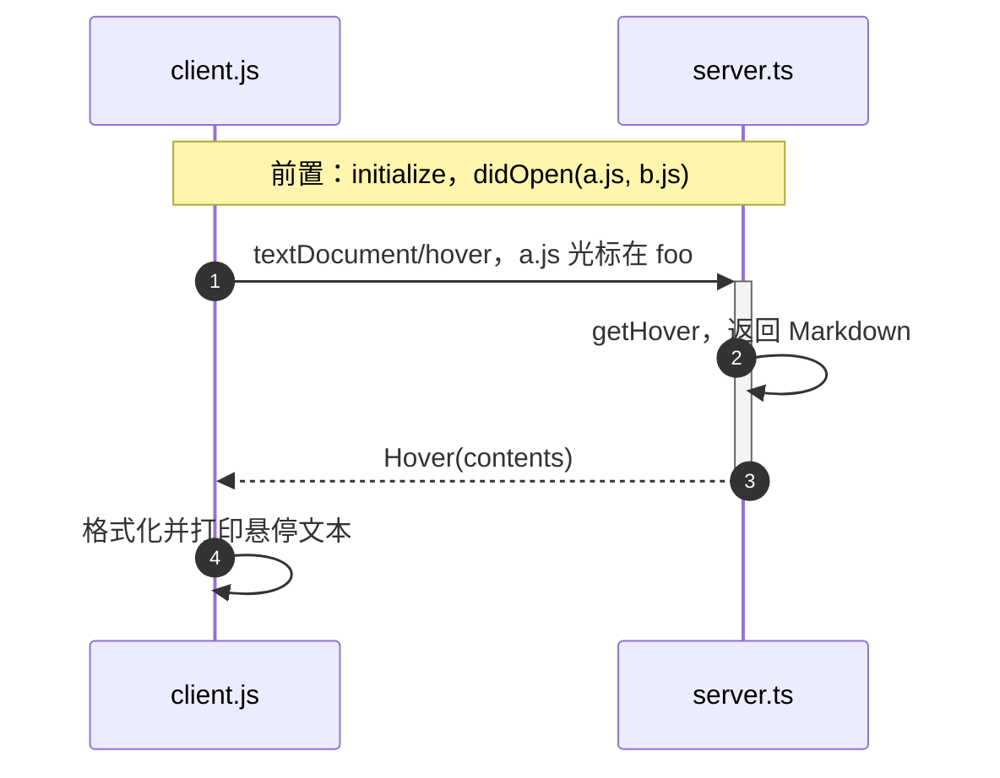
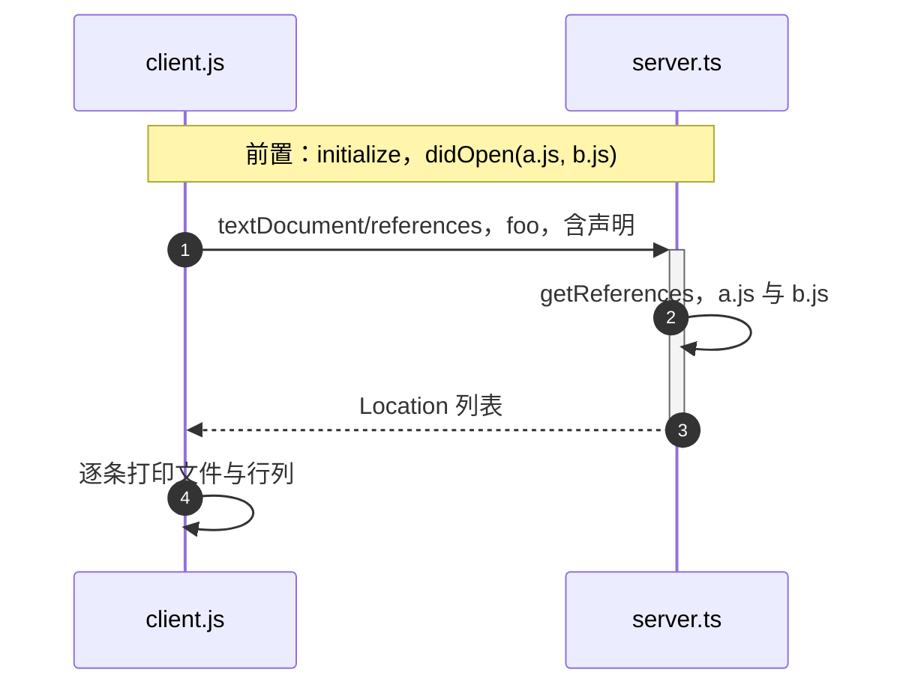
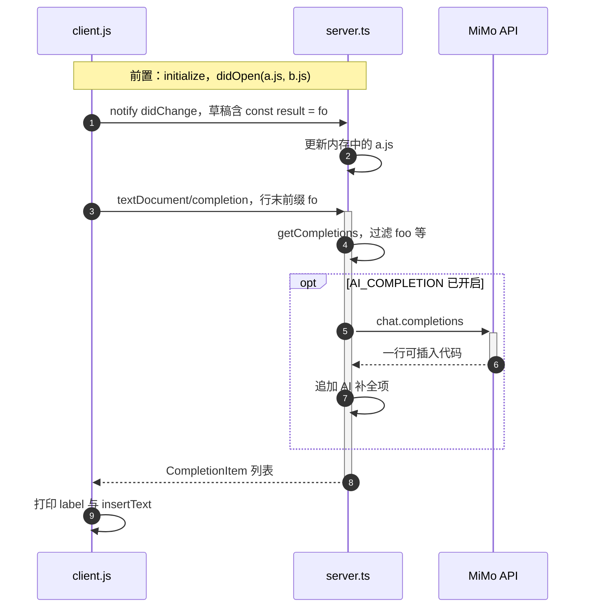
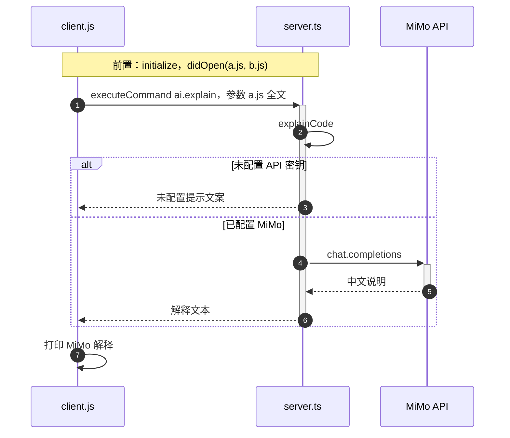

# ai-lsp-demo

用最小代码演示 **Language Server Protocol（LSP）**：编辑器（Client）与语言服务（Server）如何通过 JSON-RPC、stdio 通信，以及跳转定义、悬停、补全等常见能力如何对应到协议方法。

不实现完整 TypeScript 语言服务，而是用固定符号 `foo`（`a.js` 调用 `b.js`）模拟结果，便于先看清协议往返。

## 演示能力

运行 `pnpm demo` 后，终端依次输出【1】～【5】：

| 终端 | 能力 | LSP 方法 | client.js | server.ts |
|------|------|----------|-----------|-----------|
| 【1】 | 跳转到定义 | `textDocument/definition` | `demoGoToDefinition` | `goToDefinition` |
| 【2】 | 悬停说明 | `textDocument/hover` | `demoHover` | `getHover` |
| 【3】 | 查找引用 | `textDocument/references` | `demoReferences` | `getReferences` |
| 【4】 | 代码补全 | `textDocument/completion` | `demoCompletion` | `getCompletions` |
| 【5】 | AI 解释代码 | `workspace/executeCommand` | `demoExplainCode` | `explainCode` |

文档同步（无终端序号，但协议上必须有）：`textDocument/didOpen`、`textDocument/didChange`。

## 项目结构

```text
ai-lsp-demo/
├── client.js      # 模拟编辑器：演示流程、组 LSP 参数、打印结果
├── lsp-io.js      # 传输层：spawn 子进程、封包/拆包、request/notify
├── server.ts      # 语言服务：处理 definition / hover 等（独立子进程）
├── a.js / b.js    # 跨文件调用示例（a 调用 b 中的 foo）
├── .env.example   # 环境变量模板（【5】可选）
└── package.json
```

阅读顺序建议：**架构示意 → `client.js` 的 `main()` → `server.ts` 各 `on*` 处理函数 → `lsp-io.js` 封包细节**。

## 架构示意

本 demo 把「真实编辑器 + LSP 插件 + 语言服务」拆成 **三个文件、两个操作系统进程**。`client.js` 只关心「发什么 LSP 方法」；`lsp-io.js` 负责「怎么把 JSON 塞进管道」；`server.ts` 在子进程里跑，只关心「收到请求后返回什么」。

### 进程与分层



| 层级 | 文件 | 职责 | 关键 API |
|------|------|------|----------|
| 演示层 | `client.js` | 模拟用户操作：握手、打开文档、依次跑【1】～【5】 | `main()`、`demoGoToDefinition` 等 |
| 传输层 | `lsp-io.js` | `spawn` 拉起语言服务子进程；把 JS 对象编成 LSP 帧；把回复解成 Promise | `startLanguageServer`、`encodeMessage`、`decodeMessages`、`request`、`notify` |
| 服务层 | `server.ts` | 注册 LSP 能力，按方法名返回定义/悬停/补全等（demo 里多为写死结果） | `conn.onDefinition`、`getCompletions`、`explainCode` |

对应真实工具：演示层 ≈ VS Code 里你的操作与 UI；传输层 ≈ 编辑器内置的 LSP 客户端（本仓库单独拆出便于学习）；服务层 ≈ `typescript-language-server`、`gopls` 等独立可执行文件。

### 启动与连接（`lsp-io.js` 在干什么）

运行 `pnpm demo` 时，连接由 `lsp-io.js` 建立，而不是 `client.js` 直接连 `server.ts`：

1. **`startLanguageServer(projectRoot)`** 执行 `spawn("npx", ["tsx", "server.ts", "--stdio"])`，得到子进程句柄 **`proc`**（`ChildProcess`）。
2. **`stdio: ["pipe", "pipe", "inherit"]`**：父进程可读写 `proc.stdin` / `proc.stdout`；Server 的 stderr 仍打到终端，方便看日志。
3. 返回对象 **`lsp`**：`client.js` 只通过 `lsp.request` / `lsp.notify` / `lsp.fileUri` / `lsp.close` 与 Server 交互，不直接接触 `proc`。

```text
pnpm demo
  └─ node client.js          ← 父进程
       ├─ import lsp-io.js
       ├─ lsp = startLanguageServer()  → spawn → proc（子进程 server.ts）
       ├─ lsp.request("initialize", …)
       ├─ lsp.notify("textDocument/didOpen", …)
       └─ …【1】～【5】
```

### 一条请求如何穿过三层（以【1】跳转到定义为例）



- **`request`**：带 `id`，`lsp-io.js` 把 `{ resolve, reject }` 放进 `pending`，收到同 `id` 的回复后 resolve。
- **`notify`**：无 `id`，发完即返回（如 `didOpen`、`didChange`），Server 不应回包。

### 管道上的字节长什么样

LSP over stdio 不是裸 JSON，而是 **HTTP 风格的头 + 正文**（见 `encodeMessage` / `decodeMessages`）：

```text
Content-Length: 123
(空行)
{"jsonrpc":"2.0","id":1,"method":"textDocument/definition","params":{...}}
```

线上实际是 `Content-Length` 行 + CRLF 空行 + JSON 正文（见 `encodeMessage`）。`decodeMessages` 从 `stdout` 流式读入，按长度切出完整 body 再 `JSON.parse`；半包留在 `readBuffer` 等下一次 `data`。

### 协议规范

基于 [LSP 3.17](https://microsoft.github.io/language-server-protocol/specifications/lsp/3.17/specification/)：**语义**是 JSON-RPC 2.0 的 `method` / `params` / `result`；**传输**在本 demo 中为子进程 **stdio** + **Content-Length** 分帧（与 VS Code 启动 language server 的方式一致）。

## 功能时序图

以下五图对应终端【1】～【5】，只画 **业务语义**（`client.js` ↔ `server.ts`）。实际路径是 `client.js` → `lsp-io.js`（封包）→ `proc` 管道 → `server.ts`，见上文「架构示意」中的穿层时序图。

所有演示会先完成公共握手（`initialize` → `initialized` → `textDocument/didOpen` 同步 `a.js` / `b.js`），再依次执行各功能。

### 【1】跳转到定义

用户在 `a.js` 将光标置于 `foo` 上，请求定义位置；Server 返回 `b.js` 中 `foo` 的定义范围。



### 【2】悬停说明

光标停在 `foo` 上不跳转，请求悬停文档；Server 返回 Markdown 说明（定义位置、签名等）。



### 【3】查找引用

请求符号 `foo` 在工程内的所有出现位置；Server 返回 `a.js` 调用处与 `b.js` 定义处的 Location 列表。



### 【4】代码补全

模拟用户在 `a.js` 末尾输入 `const result = fo`：先 `didChange` 同步草稿，再请求补全；Server 按前缀过滤符号，可选再向 MiMo 要一条 AI 建议。



### 【5】AI 解释代码

通过自定义命令 `ai.explain` 把 `a.js` 全文交给 Server；Server 调用 MiMo 生成自然语言解释（未配置密钥时直接返回提示文案）。



## 快速开始

**环境**：Node.js 18+、[pnpm](https://pnpm.io/)

```bash
git clone https://github.com/FatMii/ai-lsp-demo.git
cd ai-lsp-demo
pnpm i
pnpm demo
```

【1】～【4】无需配置即可运行；【5】需 MiMo API 密钥才有真实 AI 回复（见下）。

## MiMo API（仅【5】）

【5】走 `workspace/executeCommand`，Server 用 MiMo（OpenAI 兼容）生成解释。没配密钥时 demo 仍会跑完，【5】输出为：`未配置 MIMO_API_KEY 或 AI_ENABLED=false。`

```bash
cp .env.example .env
# 填写 MIMO_API_KEY
```
